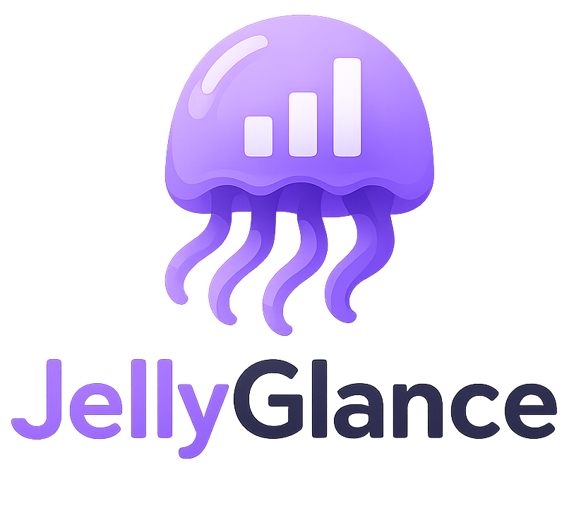

<p align="center">
  
</p>

<p align="center">
  <strong>A modern Jellyfin statistics, activity, and media-control dashboard.</strong>
</p>

<p align="center">
  Built by <strong>Nerdy-Technician</strong> for self-hosted Jellyfin servers that deserve a cleaner control room.
</p>

<p align="center">
  <a href="https://github.com/Nerdy-Technician/JellyGlance/actions/workflows/docker.yml"></a>
</p>

## Jellyfin At A Glance

JellyGlance gives your Jellyfin server a proper dashboard: live sessions, user watch stats, recent media, library health, activity history, release calendars, download queues, webhooks, backups, and integrations in one polished place.

It is made for home-server admins who want answers quickly:

- Who is watching right now?
- Which users are most active?
- What was recently added?
- Which libraries need attention?
- What releases are coming from Sonarr, Radarr, and Lidarr?
- Are download clients moving, stuck, or finished?
- Did scheduled syncs, imports, and webhook notifications actually run?

## Highlights

- **Live Active Sessions**  
  See active Jellyfin streams with device, client, codec, bitrate, user, runtime, episode details, and platform icons.

- **Recently Added Shelves**  
  Browse fresh Jellyfin items grouped by library with poster-focused rows.

- **User Dashboards**  
  Jellyfin Quick Connect users, local JellyGlance users, and OIDC-ready accounts get cleaner user cards, roles, watch summaries, and personal wrap-up pages.

- **Statistics That Feel Useful**  
  Top movies, series, libraries, clients, users, playback trends, watch time, and activity heatmaps without digging through raw logs.

- **Media Automation Hub**  
  Connect Jellyfin, Sonarr, Radarr, Lidarr, Bazarr, qBittorrent, Transmission, Deluge, SABnzbd, and NZBGet.

- **Calendar And Downloads**  
  Track upcoming releases from Arr apps and manage torrent URLs, magnet links, and torrent file uploads from connected download clients.

- **Webhook Notifications**  
  Add one or many webhook destinations and choose exactly which JellyGlance events trigger each one.

- **Backup And Restore Friendly**  
  Docker exposes `/app/config` and `/app/backups`, with compose mounts for easy copy-out backups and restore uploads.

## Quick Docker Start

Create a `docker-compose.yml`:

```yaml
services:
  jellyglance-db:
    image: postgres:16-alpine
    container_name: jellyglance-db
    restart: unless-stopped
    shm_size: "1gb"
    environment:
      POSTGRES_USER: postgres
      POSTGRES_PASSWORD: change-me
      POSTGRES_DB: jellyglance
    volumes:
      - postgres-data:/var/lib/postgresql/data
    healthcheck:
      test: ["CMD-SHELL", "pg_isready --dbname=jellyglance --username=postgres"]
      interval: 10s
      timeout: 5s
      retries: 5

  jellyglance:
    image: ghcr.io/nerdy-technician/jellyglance:latest
    container_name: jellyglance
    restart: unless-stopped
    depends_on:
      jellyglance-db:
        condition: service_healthy
    ports:
      - "3000:3000"
    environment:
      POSTGRES_USER: postgres
      POSTGRES_PASSWORD: change-me
      POSTGRES_IP: jellyglance-db
      POSTGRES_PORT: 5432
      POSTGRES_DB: jellyglance
      JWT_SECRET: replace-me-with-a-long-random-secret
      TZ: Europe/London
      CONFIG_DIR: /app/config
      BACKUP_DIR: /app/backups
    volumes:
      - ./config:/app/config
      - ./backups:/app/backups

volumes:
  postgres-data:
```

Start it:

```sh
docker compose up -d
```

Use Docker Compose v2 (`docker compose`, with a space). The old Python `docker-compose` v1 log watcher can crash on modern Docker events with `KeyError: 'id'`.

Open:

```text
http://localhost:3000
```

## First Run

1. Open JellyGlance.
2. Add your Jellyfin server URL.
3. Add a Jellyfin API key so JellyGlance can sync users, libraries, artwork, sessions, and activity.
4. Choose your admin access mode.
5. Let the first sync run.

After setup, JellyGlance can use artwork from your Jellyfin library for login backgrounds and media views.

## Persistent Folders

The Docker image is designed around simple, visible paths:

| Host path | Container path | What it is for |
| --- | --- | --- |
| `./config` | `/app/config` | Runtime config and local app files |
| `./backups` | `/app/backups` | Backup exports and restore uploads |
| `postgres-data` | PostgreSQL data volume | Database storage |

Backups created inside JellyGlance appear in `./backups`. To restore, place a backup JSON file in that folder or upload it from the Backup page.

## Integrations

JellyGlance is built to sit in the middle of a self-hosted media stack:

| Type | Apps |
| --- | --- |
| Media server | Jellyfin |
| Arr apps | Sonarr, Radarr, Lidarr, Bazarr |
| Download clients | qBittorrent, Transmission, Deluge, SABnzbd, NZBGet |
| Auth | Jellyfin Quick Connect, local accounts, OIDC-ready flow |
| Notifications | Discord-compatible webhooks, Gotify-style webhooks |

## Updates

```sh
docker compose pull
docker compose up -d
```

## Project Links

- Repository: [Nerdy-Technician/JellyGlance](https://github.com/Nerdy-Technician/JellyGlance)
- Docker image: `ghcr.io/nerdy-technician/jellyglance`

## Credits

Created by **Nerdy-Technician**.

Inspired by **Jellystat**.
