<p align="center">
  <picture>
    <source media="(prefers-color-scheme: dark)" srcset="docs/public/full-logo-white.png">
    
  </picture>
</p>

<p align="center">
  <strong>Your Jellyfin control room: live sessions, users, libraries, stats, calendars, downloads, webhooks, and tasks in one clean dashboard.</strong>
</p>

<p align="center">
  Built by <strong>Nerdy-Technician</strong> for self-hosted media servers that deserve better visibility than a pile of browser tabs.
</p>

<p align="center">
  <a href="https://github.com/Nerdy-Technician/JellyGlance/actions/workflows/docker.yml"></a>
  <a href="https://github.com/Nerdy-Technician/JellyGlance/actions/workflows/ci.yml"></a>
  <a href="https://github.com/Nerdy-Technician/JellyGlance/blob/main/LICENSE"></a>
  <a href="https://github.com/Nerdy-Technician/JellyGlance/pkgs/container/jellyglance"></a>
</p>

<p align="center">
  <a href="https://jellyglance.com/"><strong>Docs</strong></a>
  ·
  <a href="#quick-docker-start"><strong>Docker Start</strong></a>
  ·
  <a href="#screenshots"><strong>Screenshots</strong></a>
  ·
  <a href="#integrations"><strong>Integrations</strong></a>
</p>

<p align="center">
  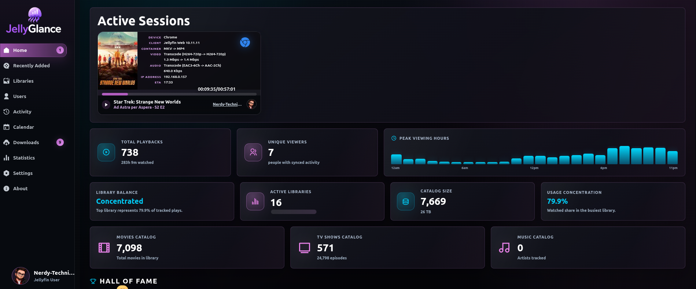
</p>

<p align="center">
  <sub>Live streams, watch history, library health, release planning, download queues, and access control without leaving the dashboard.</sub>
</p>

## Why JellyGlance

JellyGlance gives your Jellyfin server a proper dashboard: live sessions, user watch stats, recent media, library health, activity history, release calendars, download queues, webhooks, backups, and integrations in one polished place.

| See | Manage | Automate |
| --- | --- | --- |
| Live streams, playback history, watch-time trends, user activity, and recently added media. | Jellyfin users, JellyGlance roles, local accounts, Quick Connect, API keys, backups, and settings. | Arr calendars, download queues, scheduled syncs, health checks, and webhook notifications. |

## Highlights

- **Live active sessions** with device, client, codec, bitrate, user, runtime, episode details, and platform icons.
- **Recently added shelves** grouped by library with poster-first rows for fast scanning.
- **User dashboards** for Jellyfin Quick Connect users, local JellyGlance users, and OIDC-ready accounts.
- **Useful statistics** covering top movies, series, libraries, clients, users, trends, watch time, and activity heatmaps.
- **Media automation hub** for Jellyfin, Sonarr, Radarr, Lidarr, Bazarr, qBittorrent, Transmission, Deluge, SABnzbd, and NZBGet.
- **Calendar and downloads** for release planning, torrent URLs, magnet links, torrent uploads, and active queues.
- **Webhook notifications** for session, media, task, backup, download, and health events.
- **Backup and restore friendly** Docker paths via `/app/config` and `/app/backups`.

## Feature Map

| Area | What You Get |
| --- | --- |
| Dashboard | Active stream counts, server snapshots, recent media, and quick operational context. |
| Activity | Playback history with users, devices, clients, libraries, items, and timeline views. |
| Libraries | Library cards, item details, metadata, images, purge tools, and tracked-library controls. |
| Users | Jellyfin users, local accounts, roles, permissions, disabled users, and profile pages. |
| Statistics | Most-played items, active users, popular libraries, client usage, days, hours, and watch-time charts. |
| Integrations | Arr apps, download clients, health checks, release calendar data, and queue monitoring. |
| Settings | Security, API keys, tasks, webhooks, backups, activity monitor tuning, and logs. |

## Screenshots

<details open>
<summary><strong>Dashboard, Activity, And Libraries</strong></summary>

| Dashboard | Activity |
| --- | --- |
|  | 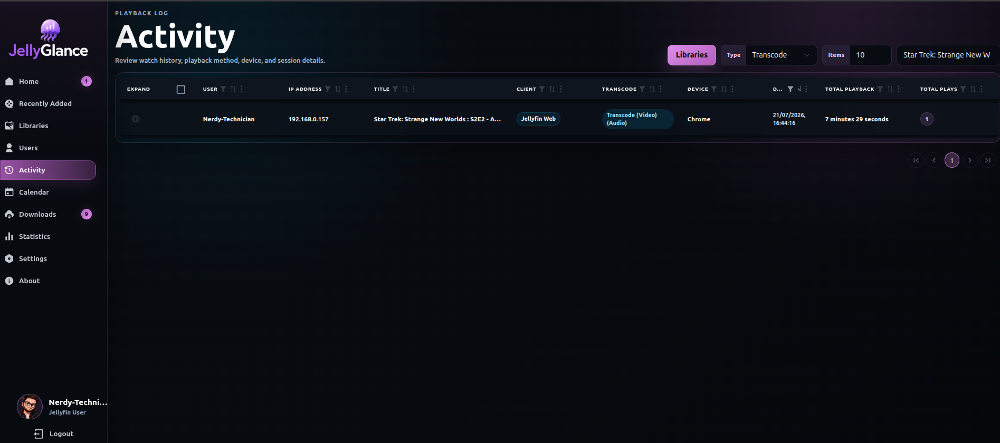 |

| Libraries | Recently Added |
| --- | --- |
| 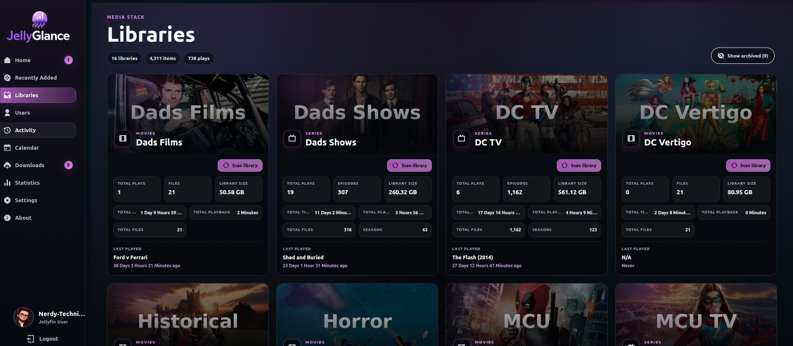 | 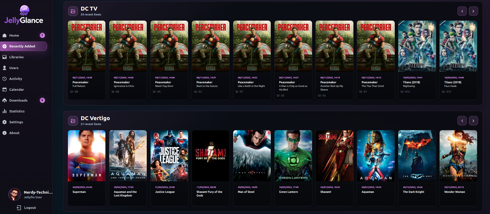 |

</details>

<details>
<summary><strong>Users, Statistics, Calendar, And Downloads</strong></summary>

| Statistics | Users |
| --- | --- |
| 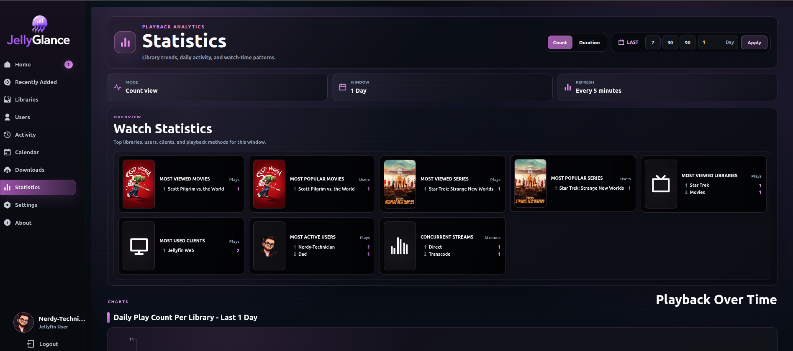 | 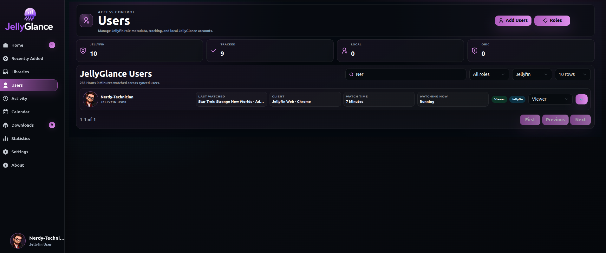 |

| Calendar | Downloads |
| --- | --- |
| 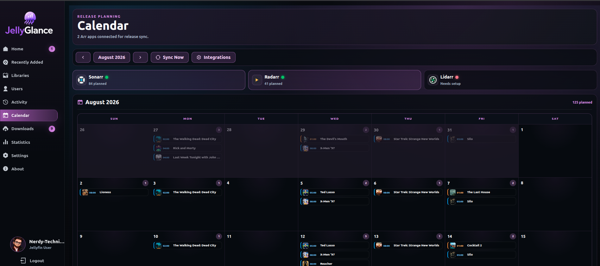 | 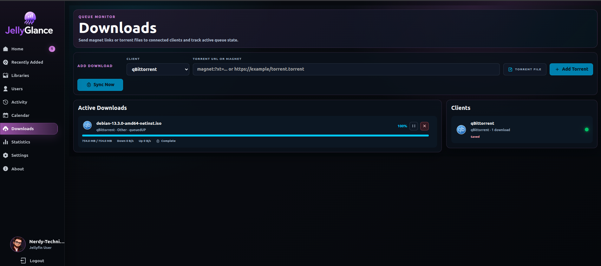 |

</details>

<details>
<summary><strong>Settings And Operations</strong></summary>

| Settings | Activity Settings |
| --- | --- |
| 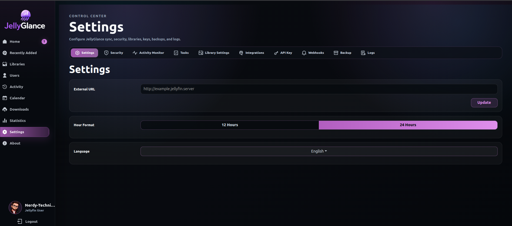 | 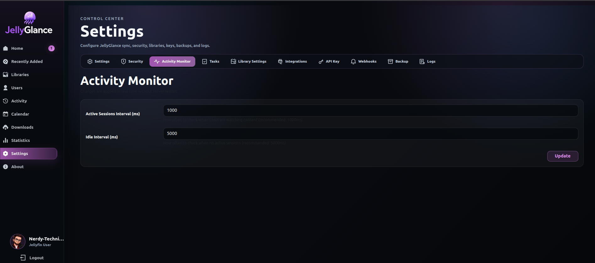 |

| Security | Tasks |
| --- | --- |
| 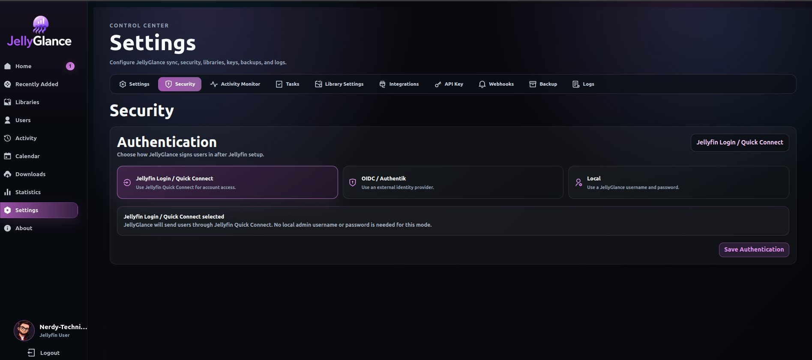 | 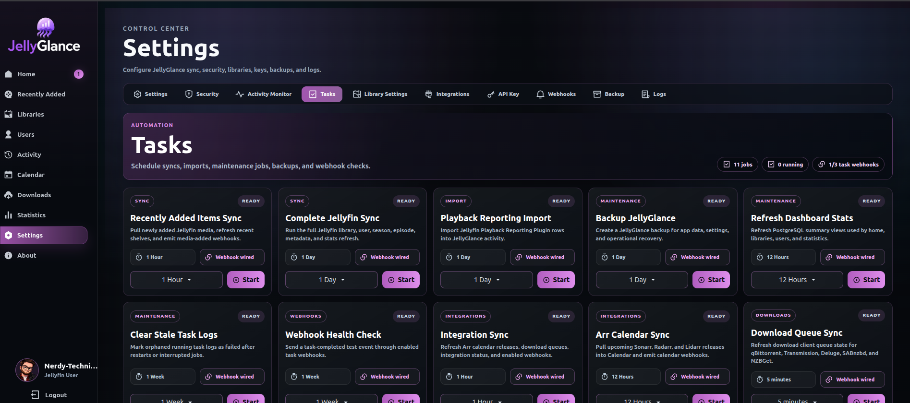 |

| Webhooks | Profile |
| --- | --- |
| 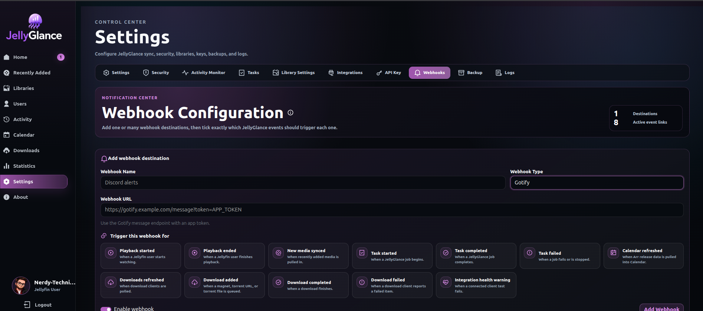 | 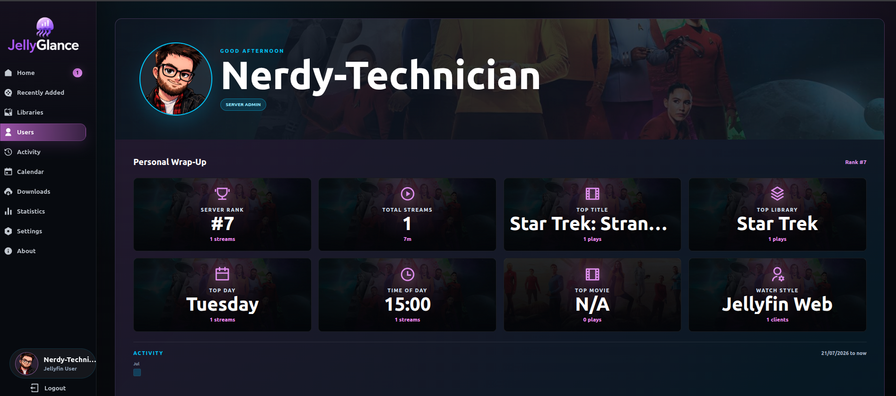 |

</details>

## Quick Docker Start

Create a `docker-compose.yml`:

```yaml
services:
  jellyglance-db:
    image: postgres:16-alpine
    container_name: jellyglance-db
    restart: unless-stopped
    shm_size: "1gb"
    environment:
      POSTGRES_USER: postgres
      POSTGRES_PASSWORD: change-me
      POSTGRES_DB: jellyglance
    volumes:
      - postgres-data:/var/lib/postgresql/data
    healthcheck:
      test: ["CMD-SHELL", "pg_isready --dbname=jellyglance --username=postgres"]
      interval: 10s
      timeout: 5s
      retries: 5

  jellyglance:
    image: ghcr.io/nerdy-technician/jellyglance:latest
    container_name: jellyglance
    restart: unless-stopped
    depends_on:
      jellyglance-db:
        condition: service_healthy
    ports:
      - "3000:3000"
    environment:
      POSTGRES_USER: postgres
      POSTGRES_PASSWORD: change-me
      POSTGRES_IP: jellyglance-db
      POSTGRES_PORT: 5432
      POSTGRES_DB: jellyglance
      JWT_SECRET: replace-me-with-a-long-random-secret
      TZ: Europe/London
      CONFIG_DIR: /app/config
      BACKUP_DIR: /app/backups
    volumes:
      - ./config:/app/config
      - ./backups:/app/backups

volumes:
  postgres-data:
```

Start it:

```sh
docker compose up -d
```

Use Docker Compose v2 (`docker compose`, with a space). The old Python `docker-compose` v1 log watcher can crash on modern Docker events with `KeyError: 'id'`.

Open:

```text
http://localhost:3000
```

## First Run

1. Open JellyGlance.
2. Add your Jellyfin server URL.
3. Add a Jellyfin API key so JellyGlance can sync users, libraries, artwork, sessions, and activity.
4. Choose your admin access mode.
5. Let the first sync run.

After setup, JellyGlance can use artwork from your Jellyfin library for login backgrounds and media views.

## Persistent Folders

The Docker image is designed around simple, visible paths:

| Host path | Container path | What it is for |
| --- | --- | --- |
| `./config` | `/app/config` | Runtime config and local app files |
| `./backups` | `/app/backups` | Backup exports and restore uploads |
| `postgres-data` | PostgreSQL data volume | Database storage |

Backups created inside JellyGlance appear in `./backups`. To restore, place a backup JSON file in that folder or upload it from the Backup page.

## Integrations

JellyGlance is built to sit in the middle of a self-hosted media stack:

| Type | Apps |
| --- | --- |
| Media server | Jellyfin |
| Arr apps | Sonarr, Radarr, Lidarr, Bazarr |
| Download clients | qBittorrent, Transmission, Deluge, SABnzbd, NZBGet |
| Auth | Jellyfin Quick Connect, local accounts, OIDC-ready flow |
| Notifications | Discord-compatible webhooks, Gotify-style webhooks |

## Updates

```sh
docker compose pull
docker compose up -d
```

## Project Links

- Repository: [Nerdy-Technician/JellyGlance](https://github.com/Nerdy-Technician/JellyGlance)
- Docker image: `ghcr.io/nerdy-technician/jellyglance`
- Documentation: [jellyglance.com](https://jellyglance.com/)

## GitHub Topics

Suggested repository topics:

`jellyfin`, `jellyfin-dashboard`, `media-server`, `self-hosted`, `analytics`, `playback-statistics`, `quick-connect`, `sonarr`, `radarr`, `lidarr`, `bazarr`, `qbittorrent`, `docker`, `postgresql`, `react`

## Credits

Created by **Nerdy-Technician**.

Inspired by **Jellystat**.
