<p align="center">
  <picture>
    <source media="(prefers-color-scheme: dark)" srcset="docs/public/full-logo-transparent.png">
    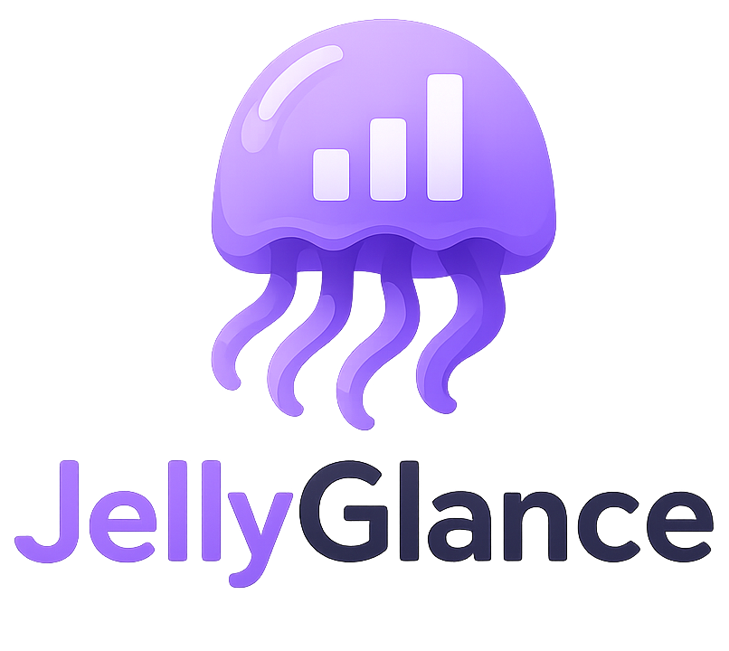
  </picture>
</p>

<p align="center">
  <strong>Your Jellyfin command center: live sessions, requests, users, libraries, stats, calendars, downloads, health, webhooks, and tasks in one clean dashboard.</strong>
</p>

<p align="center">
  Built by <strong>Nerdy-Technician</strong> for self-hosted media servers that deserve better visibility than a pile of browser tabs.
</p>

<p align="center">
  <a href="https://github.com/Nerdy-Technician/JellyGlance/releases/latest">
    
  </a>

  <a href="https://github.com/Nerdy-Technician/JellyGlance/releases">
    
  </a>

  <a href="https://github.com/Nerdy-Technician/JellyGlance/stargazers">
    
  </a>

  <a href="https://github.com/Nerdy-Technician/JellyGlance/actions/workflows/docker.yml">
    
  </a>

  <a href="https://github.com/Nerdy-Technician/JellyGlance/actions/workflows/ci.yml">
    
  </a>

  <a href="https://github.com/Nerdy-Technician/JellyGlance/blob/main/LICENSE">
    
  </a>

  <a href="https://github.com/Nerdy-Technician/JellyGlance/pkgs/container/jellyglance">
    
  </a>
</p>


<p align="center">
  <a href="https://jellyglance.com/"><strong>Docs</strong></a>
  ·
  <a href="https://discord.gg/dMGhv8j2kx"><strong>Discord</strong></a>
  ·
  <a href="#quick-docker-start"><strong>Docker Start</strong></a>
  ·
  <a href="#screenshots"><strong>Screenshots</strong></a>
  ·
  <a href="#integrations"><strong>Integrations</strong></a>
</p>

<p align="center">
  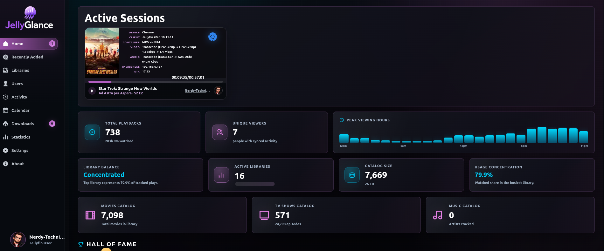
</p>

<p align="center">
  <sub>Live streams, request triage, watch history, library health, release planning, download queues, and access control without leaving the dashboard.</sub>
</p>

## Why JellyGlance

JellyGlance gives your Jellyfin server a proper dashboard: live sessions, request triage, user watch stats, recent media, library health, activity history, release calendars, download queues, webhooks, backups, and integrations in one polished place.

| Watch | Triage | Operate |
| --- | --- | --- |
| Live streams, playback history, watch-time trends, user activity, favourites, watchlists, and recently added media. | Jellyseerr/Overseerr requests, Jellyfin availability, failed integrations, webhook delivery, backups, and user access. | Arr calendars, download queues, scheduled syncs, health checks, quick actions, audit history, and webhook notifications. |

## What's New

| Command Center | Request Center | Wizarr Invites |
| --- | --- | --- |
| Custom home order, show/hide toggles, presets, density modes, themes, kiosk URL, alert rules, section refresh controls, and quick actions. | Jellyseerr and Overseerr sources, combined search/queue, poster cards, cast lists, ratings, season controls, routing options, request actions, and click-through details. | Create, copy, open, delete, and sync Wizarr invite links with custom invite codes, server/library selection, optional wizard bundle IDs, tasks, and webhook events. |

| Operations | Integrations | User Profiles |
| --- | --- | --- |
| Health dashboard, integration uptime, webhook delivery history, admin audit log, backup freshness, invite sync, and automation activity feed. | Jellyfin, Arr apps, Seerr apps, Wizarr, download clients, webhook targets, direct settings hashes, plugin artwork, and only-enabled health summaries. | Favourites, watchlist split by Movies and Shows, Continue Watching, Recently Watched, next episodes, watchlist actions, and per-user media search. |

## Highlights

- **Live active sessions** with device, client, codec, bitrate, user, runtime, episode details, and platform icons.
- **Customizable home command center** with drag-and-drop section order, visibility toggles, presets, density, themes, kiosk mode, and alert rules.
- **Requests page** for Jellyseerr and Overseerr with combined search, posters, ratings, cast lists, season controls, route editing, availability checks, request actions, and direct open links.
- **Wizarr invite management** with custom invite codes, server and library targeting, optional wizard bundle IDs, copy/open/delete actions, invite sync, and invite webhook notifications.
- **Recently added shelves** grouped by library with poster-first rows for fast scanning.
- **User dashboards** for Jellyfin Quick Connect users, local JellyGlance users, OIDC-ready accounts, favourites, watchlists, Continue Watching, and recently watched media.
- **Useful statistics** covering top movies, series, libraries, clients, users, trends, watch time, and activity heatmaps.
- **Media automation hub** for Jellyfin, Sonarr, Radarr, Lidarr, Bazarr, Jellyseerr, Overseerr, Wizarr, qBittorrent, Transmission, Deluge, SABnzbd, and NZBGet.
- **Calendar and downloads** for release planning, torrent URLs, magnet links, torrent uploads, and active queues.
- **Webhook notifications** with delivery history for session, media, request, task, backup, download, and health events.
- **Admin audit trail** for settings, auth, integrations, webhooks, roles, backups, and restore-sensitive actions.
- **Backup and restore friendly** Docker paths via `/app/config` and `/app/backups`.

## Feature Map

| Area | What You Get |
| --- | --- |
| Dashboard | Active stream counts, server snapshots, recent media, home section ordering, presets, quick actions, health alerts, watch party suggestions, and operational context. |
| Activity | Playback history with users, devices, clients, libraries, items, and timeline views. |
| Libraries | Library cards, item details, metadata, images, purge tools, and tracked-library controls. |
| Requests | Jellyseerr and Overseerr request cards, posters, filters, sorting, availability, actions, retry/open controls, and summary badges. |
| Users | Jellyfin users, local accounts, roles, permissions, disabled users, profile pages, favourites, watchlists, Continue Watching, and recently watched rails. |
| Statistics | Most-played items, active users, popular libraries, client usage, days, hours, and watch-time charts. |
| Integrations | Arr apps, Seerr apps, download clients, health checks, uptime history, release calendar data, and queue monitoring. |
| Settings | Security, API keys, tasks, webhooks, webhook delivery history, backups, health dashboard, admin audit log, activity monitor tuning, and logs. |

## Screenshots

<details open>
<summary><strong>Dashboard, Activity, And Libraries</strong></summary>

| Dashboard | Activity |
| --- | --- |
|  | 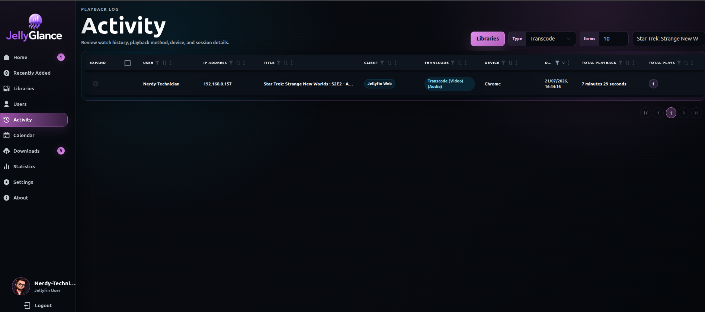 |

| Libraries | Recently Added |
| --- | --- |
| 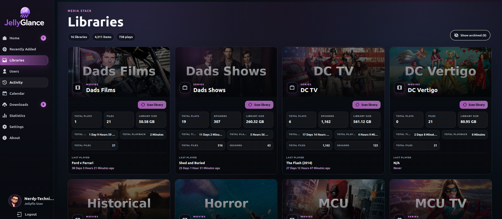 | 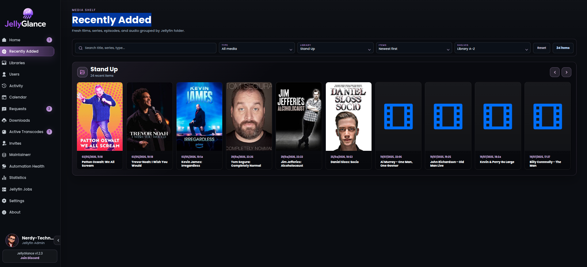 |

</details>

<details>
<summary><strong>Users, Statistics, Calendar, And Downloads</strong></summary>

| Statistics | Users |
| --- | --- |
| 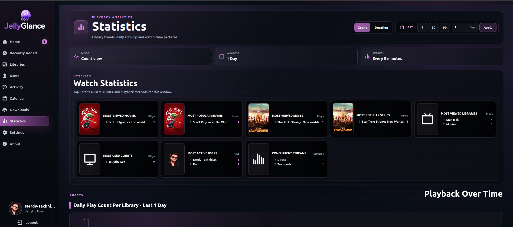 | 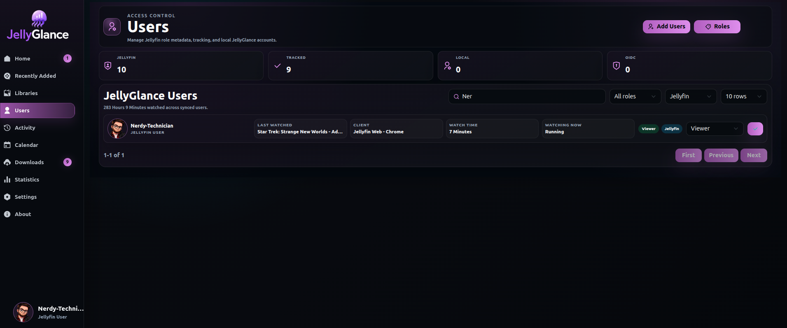 |

| Calendar | Downloads |
| --- | --- |
| 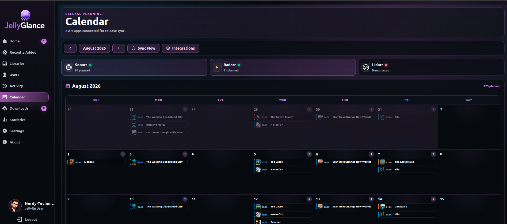 | 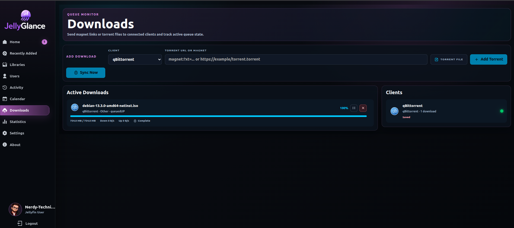 |

</details>

<details>
<summary><strong>Settings And Operations</strong></summary>

| Settings | Activity Settings |
| --- | --- |
| 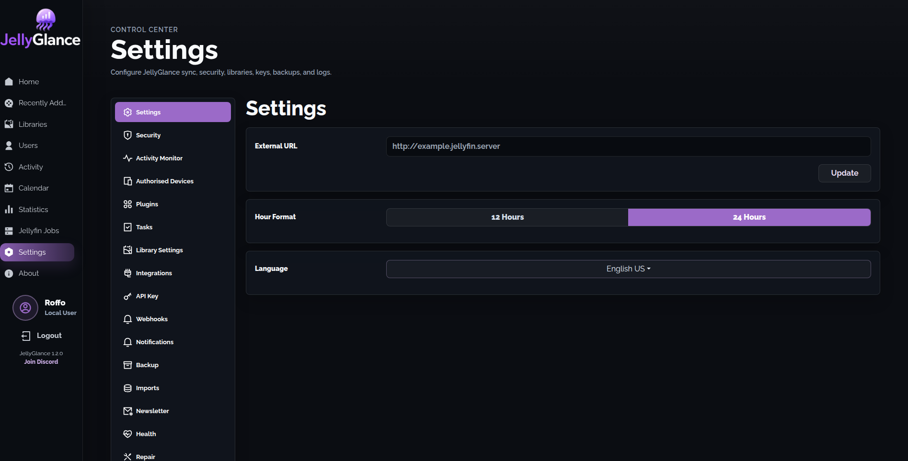 | 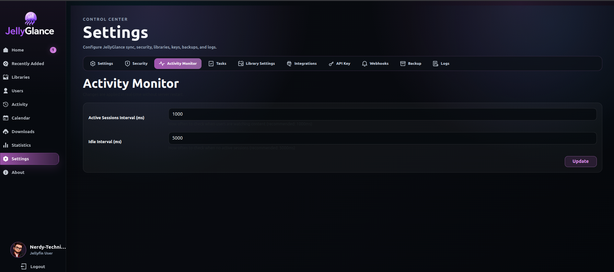 |

The refreshed Settings center uses a persistent sidebar for general settings, security, authorised Jellyfin devices, plugins, tasks, integrations, webhooks, notifications, backups, imports, health, repair, and logs.

| Security | Tasks |
| --- | --- |
| 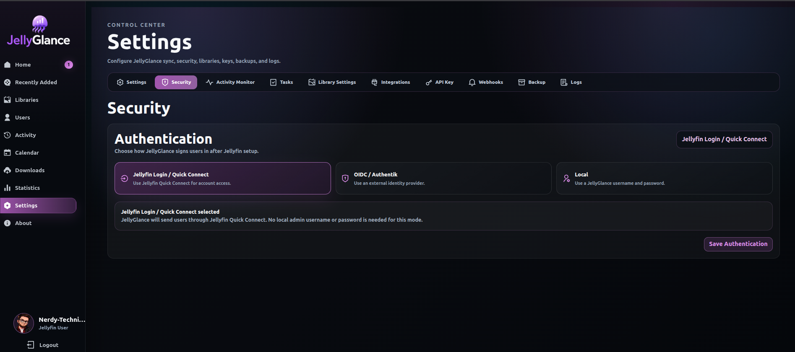 | 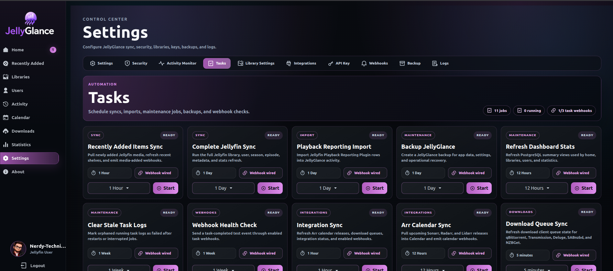 |

| Webhooks | Profile |
| --- | --- |
| 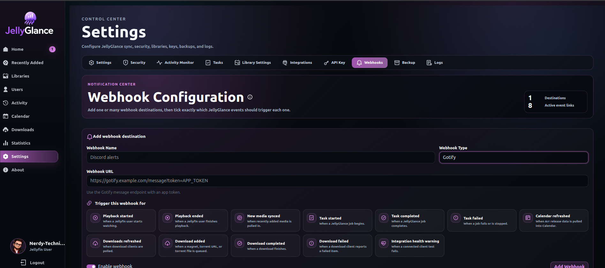 | 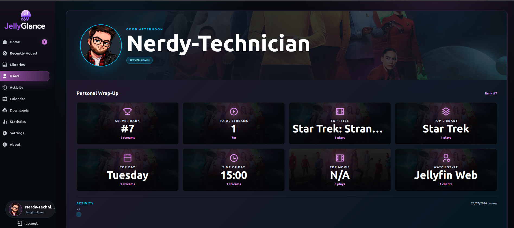 |

</details>

## Quick Docker Start

Create a `docker-compose.yml`:

```yaml
services:
  jellyglance-db:
    image: postgres:16-alpine
    container_name: jellyglance-db
    restart: unless-stopped
    shm_size: "1gb"
    environment:
      POSTGRES_USER: postgres
      POSTGRES_PASSWORD: change-me
      POSTGRES_DB: jellyglance
    volumes:
      - postgres-data:/var/lib/postgresql/data
    healthcheck:
      test: ["CMD-SHELL", "pg_isready --dbname=jellyglance --username=postgres"]
      interval: 10s
      timeout: 5s
      retries: 5

  jellyglance:
    image: ghcr.io/nerdy-technician/jellyglance:latest
    container_name: jellyglance
    restart: unless-stopped
    depends_on:
      jellyglance-db:
        condition: service_healthy
    ports:
      - "3000:3000"
    environment:
      POSTGRES_USER: postgres
      POSTGRES_PASSWORD: change-me
      POSTGRES_IP: jellyglance-db
      POSTGRES_PORT: 5432
      POSTGRES_DB: jellyglance
      JWT_SECRET: replace-me-with-a-long-random-secret
      TZ: Europe/London
      CONFIG_DIR: /app/config
      BACKUP_DIR: /app/backups
    volumes:
      - ./config:/app/config
      - ./backups:/app/backups

volumes:
  postgres-data:
```

Start it:

```sh
docker compose up -d
```

Use Docker Compose v2 (`docker compose`, with a space). The old Python `docker-compose` v1 log watcher can crash on modern Docker events with `KeyError: 'id'`.

Open:

```text
http://localhost:3000
```

## First Run

1. Open JellyGlance.
2. Add your Jellyfin server URL.
3. Add a Jellyfin API key so JellyGlance can sync users, libraries, artwork, sessions, and activity.
4. Choose your admin access mode.
5. Let the first sync run.

After setup, JellyGlance can use artwork from your Jellyfin library for login backgrounds and media views.

## Persistent Folders

The Docker image is designed around simple, visible paths:

| Host path | Container path | What it is for |
| --- | --- | --- |
| `./config` | `/app/config` | Runtime config and local app files |
| `./backups` | `/app/backups` | Backup exports and restore uploads |
| `postgres-data` | PostgreSQL data volume | Database storage |

Backups created inside JellyGlance appear in `./backups`. To restore, place a backup JSON file in that folder or upload it from the Backup page.

## Integrations

JellyGlance is built to sit in the middle of a self-hosted media stack:

| Type | Apps |
| --- | --- |
| Media server | Jellyfin |
| Arr apps | Sonarr, Radarr, Lidarr, Bazarr |
| Seerr apps | Jellyseerr, Overseerr |
| Download clients | qBittorrent, Transmission, Deluge, SABnzbd, NZBGet |
| Auth | Jellyfin Quick Connect, local accounts, OIDC-ready flow |
| Notifications | Discord-compatible webhooks, Gotify-style webhooks, delivery history |

## Updates

```sh
docker compose pull
docker compose up -d
```

The published Docker image supports `linux/amd64`, `linux/arm64`, and `linux/arm/v7` (armhf). Docker automatically pulls the matching image for Raspberry Pi and other ARM hosts.

## Translations

JellyGlance uses `en-GB` as the source locale at `apps/web/public/locales/en-GB/translation.json`.

```sh
npm run i18n:sync
npm run i18n:check
```

## Project Links

- Repository: [Nerdy-Technician/JellyGlance](https://github.com/Nerdy-Technician/JellyGlance)
- Docker image: `ghcr.io/nerdy-technician/jellyglance`
- Documentation: [jellyglance.com](https://jellyglance.com/)
- Discord: [Join the JellyGlance community](https://discord.gg/dMGhv8j2kx)

## Community

Need help, want to show off a dashboard, or have an idea for the next Jellyfin-friendly feature? Join the JellyGlance Discord:

<p align="center">
  <a href="https://discord.gg/dMGhv8j2kx"><strong>discord.gg/dMGhv8j2kx</strong></a>
</p>

## Credits

Created by **Nerdy-Technician**.

Inspired by **Jellystat**.
