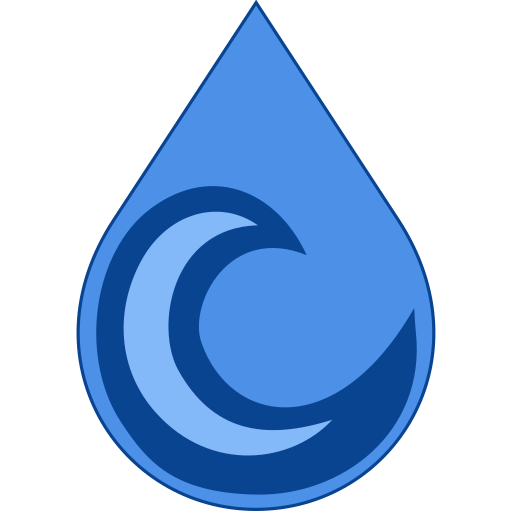

<p align="center">
  <picture>
    <source media="(prefers-color-scheme: dark)" srcset="docs/public/full-logo-transparent.png">
    
  </picture>
</p>

<p align="center">
  <strong>Your Jellyfin command center: live sessions, requests, users, libraries, stats, calendars, downloads, health, webhooks, and tasks in one clean dashboard.</strong>
</p>

<p align="center">
  Built by <strong>Nerdy-Technician</strong> for self-hosted media servers that deserve better visibility than a pile of browser tabs.
</p>

<p align="center">
  <a href="https://github.com/Nerdy-Technician/JellyGlance/releases/latest">
    
  </a>

  <a href="https://github.com/Nerdy-Technician/JellyGlance/releases">
    
  </a>

  <a href="https://github.com/Nerdy-Technician/JellyGlance/stargazers">
    
  </a>

  <a href="https://github.com/Nerdy-Technician/JellyGlance/actions/workflows/docker.yml">
    
  </a>

  <a href="https://github.com/Nerdy-Technician/JellyGlance/actions/workflows/ci.yml">
    
  </a>

  <a href="https://github.com/Nerdy-Technician/JellyGlance/blob/main/LICENSE">
    
  </a>

  <a href="https://github.com/Nerdy-Technician/JellyGlance/pkgs/container/jellyglance">
    
  </a>
</p>


<p align="center">
  <a href="https://jellyglance.com/"><strong>Docs</strong></a>
  ·
  <a href="https://discord.gg/dMGhv8j2kx"><strong>Discord</strong></a>
  ·
  <a href="#quick-docker-start"><strong>Docker Start</strong></a>
  ·
  <a href="#integrations"><strong>Integrations</strong></a>
</p>

## Why JellyGlance

JellyGlance gives your Jellyfin server a proper dashboard: live sessions, request triage, user watch stats, recent media, library health, activity history, release calendars, download queues, webhooks, backups, and integrations in one polished place.

It is built around three jobs:

- **Watch** live streams, playback history, watch-time trends, user activity, favourites, watchlists, and recently added media.
- **Triage** requests, Jellyfin availability, failed integrations, webhook delivery, backups, and user access.
- **Operate** calendars, download queues, scheduled syncs, health checks, quick actions, audit history, and notifications.

## Highlights

- **Live active sessions** with device, client, codec, bitrate, user, runtime, episode details, and platform icons.
- **Customizable home command center** with drag-and-drop section order, visibility toggles, presets, density, themes, kiosk mode, and alert rules.
- **Requests page** for Jellyseerr and Overseerr with combined search, posters, ratings, cast lists, season controls, route editing, availability checks, request actions, and direct open links.
- **Wizarr invite management** with custom invite codes, server and library targeting, optional wizard bundle IDs, copy/open/delete actions, invite sync, and invite webhook notifications.
- **3rd party app support** for Tdarr transcodes, Maintainerr cleanup, SickChill, Arr apps, Seerr apps, download clients, and webhooks.
- **Recently added shelves** grouped by library with poster-first rows for fast scanning.
- **User dashboards** for Jellyfin Quick Connect users, local JellyGlance users, OIDC-ready accounts, favourites, watchlists, Continue Watching, and recently watched media.
- **Useful statistics** covering top movies, series, libraries, clients, users, trends, watch time, and activity heatmaps.
- **Calendar and downloads** for release planning, torrent URLs, magnet links, torrent uploads, and active queues.
- **Webhook notifications** with delivery history for session, media, request, task, backup, download, and health events.
- **Admin audit trail** for settings, auth, integrations, webhooks, roles, backups, and restore-sensitive actions.
- **Backup and restore friendly** Docker paths via `/app/config` and `/app/backups`.

## Integrations

<table>
  <tr>
    <td align="center" width="20%">
      <br>
      <strong>Jellyfin</strong>
    </td>
    <td align="center" width="20%">
      <br>
      <strong>Wizarr</strong>
    </td>
    <td align="center" width="20%">
      <br>
      <strong>Tdarr</strong>
    </td>
    <td align="center" width="20%">
      <br>
      <strong>Maintainerr</strong>
    </td>
    <td align="center" width="20%">
      <br>
      <strong>SickChill</strong>
    </td>
  </tr>
  <tr>
    <td align="center">
      <br>
      <strong>Sonarr</strong>
    </td>
    <td align="center">
      <br>
      <strong>Radarr</strong>
    </td>
    <td align="center">
      <br>
      <strong>Lidarr</strong>
    </td>
    <td align="center">
      <br>
      <strong>Bazarr</strong>
    </td>
    <td align="center">
      <br>
      <strong>Prowlarr</strong>
    </td>
  </tr>
  <tr>
    <td align="center">
      <br>
      <strong>Jellyseerr</strong>
    </td>
    <td align="center">
      <br>
      <strong>Overseerr</strong>
    </td>
    <td align="center">
      <br>
      <strong>qBittorrent</strong>
    </td>
    <td align="center">
      <br>
      <strong>Transmission</strong>
    </td>
    <td align="center">
      <br>
      <strong>Deluge</strong>
    </td>
  </tr>
  <tr>
    <td align="center">
      <br>
      <strong>SABnzbd</strong>
    </td>
    <td align="center">
      <br>
      <strong>NZBGet</strong>
    </td>
    <td align="center">
      <br>
      <strong>Discord</strong>
    </td>
    <td align="center">
      <br>
      <strong>Gotify</strong>
    </td>
  </tr>
</table>

## Quick Docker Start

Create a `docker-compose.yml`:

```yaml
services:
  jellyglance-db:
    image: postgres:16-alpine
    container_name: jellyglance-db
    restart: unless-stopped
    shm_size: "1gb"
    environment:
      POSTGRES_USER: postgres
      POSTGRES_PASSWORD: change-me
      POSTGRES_DB: jellyglance
    volumes:
      - postgres-data:/var/lib/postgresql/data
    healthcheck:
      test: ["CMD-SHELL", "pg_isready --dbname=jellyglance --username=postgres"]
      interval: 10s
      timeout: 5s
      retries: 5

  jellyglance:
    image: ghcr.io/nerdy-technician/jellyglance:latest
    container_name: jellyglance
    restart: unless-stopped
    depends_on:
      jellyglance-db:
        condition: service_healthy
    ports:
      - "3000:3000"
    environment:
      POSTGRES_USER: postgres
      POSTGRES_PASSWORD: change-me
      POSTGRES_IP: jellyglance-db
      POSTGRES_PORT: 5432
      POSTGRES_DB: jellyglance
      JWT_SECRET: replace-me-with-a-long-random-secret
      TZ: Europe/London
      CONFIG_DIR: /app/config
      BACKUP_DIR: /app/backups
    volumes:
      - ./config:/app/config
      - ./backups:/app/backups

volumes:
  postgres-data:
```

Start it:

```sh
docker compose up -d
```

Use Docker Compose v2 (`docker compose`, with a space). The old Python `docker-compose` v1 log watcher can crash on modern Docker events with `KeyError: 'id'`.

Open:

```text
http://localhost:3000
```

## First Run

1. Open JellyGlance.
2. Add your Jellyfin server URL.
3. Add a Jellyfin API key so JellyGlance can sync users, libraries, artwork, sessions, and activity.
4. Choose your admin access mode.
5. Let the first sync run.

After setup, JellyGlance can use artwork from your Jellyfin library for login backgrounds and media views.

## Persistent Folders

The Docker image is designed around simple, visible paths:

| Host path | Container path | What it is for |
| --- | --- | --- |
| `./config` | `/app/config` | Runtime config and local app files |
| `./backups` | `/app/backups` | Backup exports and restore uploads |
| `postgres-data` | PostgreSQL data volume | Database storage |

Backups created inside JellyGlance appear in `./backups`. To restore, place a backup JSON file in that folder or upload it from the Backup page.

## Updates

```sh
docker compose pull
docker compose up -d
```

## Community

Need help, want to show off a dashboard, or have an idea for the next Jellyfin-friendly feature? Join the JellyGlance Discord:

<p align="center">
  <a href="https://discord.gg/dMGhv8j2kx"><strong>discord.gg/dMGhv8j2kx</strong></a>
</p>

## Credits

Created by **Nerdy-Technician**.

Inspired by **Jellystat**.
